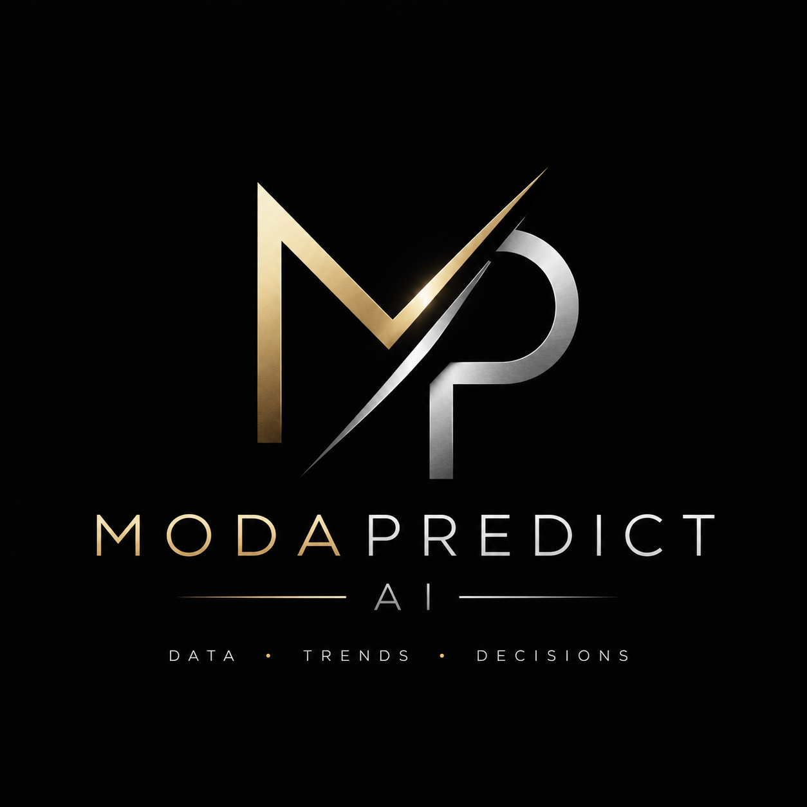

<div align="center">



# ModaPredict AI

### Transformando datos en decisiones inteligentes

Plataforma de inteligencia comercial para emprendedores y empresas del sector moda, desarrollada mediante Ciencia de Datos, aprendizaje automático y análisis de inventarios.

</div>

---

## Descripción

**ModaPredict AI** es una plataforma diseñada para apoyar la toma de decisiones comerciales en negocios del sector moda.

La solución cuenta con dos perfiles principales:

### Perfil Emprendedor

Permite seleccionar una ciudad y registrar un presupuesto en pesos mexicanos para obtener:

- categorías con mayor oportunidad;
- productos compatibles con el presupuesto;
- indicadores comerciales;
- recomendaciones personalizadas;
- apoyo mediante el asistente ModaPredict Advisor.

### Perfil Empresa

Permite cargar un inventario mediante Excel o CSV para:

- validar automáticamente la estructura del archivo;
- detectar productos agotados o con stock crítico;
- identificar sobrestock y artículos sin movimiento;
- analizar márgenes comerciales;
- obtener recomendaciones accionables;
- generar un reporte ejecutivo en PDF.

---

## Funcionalidades principales

- Recomendador de productos.
- Dashboard para emprendedores.
- Dashboard empresarial.
- Asistente conversacional especializado.
- Análisis automático de inventarios.
- Generación de reportes PDF.
- Analítica y transparencia del modelo.
- Conversión de precios y presupuestos entre USD y MXN.
- Integración de catálogo, tendencias y variables climáticas.

---

## Modelo predictivo

El modelo principal de ModaPredict AI es:

```text
HistGradientBoostingRegressor